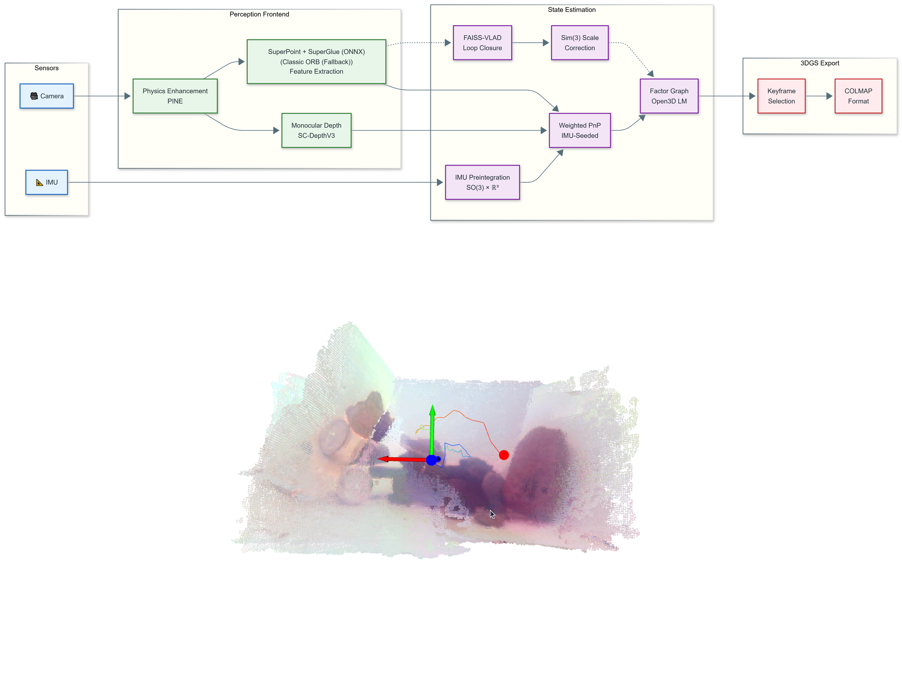

# AquaTwin-VINS
Optimal Perception under Triple Constraints: A Real-time Edge-Based Visual-Inertial Navigation and Digital Twinning Interface for Underwater Exploration
Dataset: https://drive.google.com/file/d/1DQL1M5odR1Rb7ZTxs9L6LqAKBgI8IAIu/view?usp=sharing

Dr. Jinxin SHAO
2026/1/16
