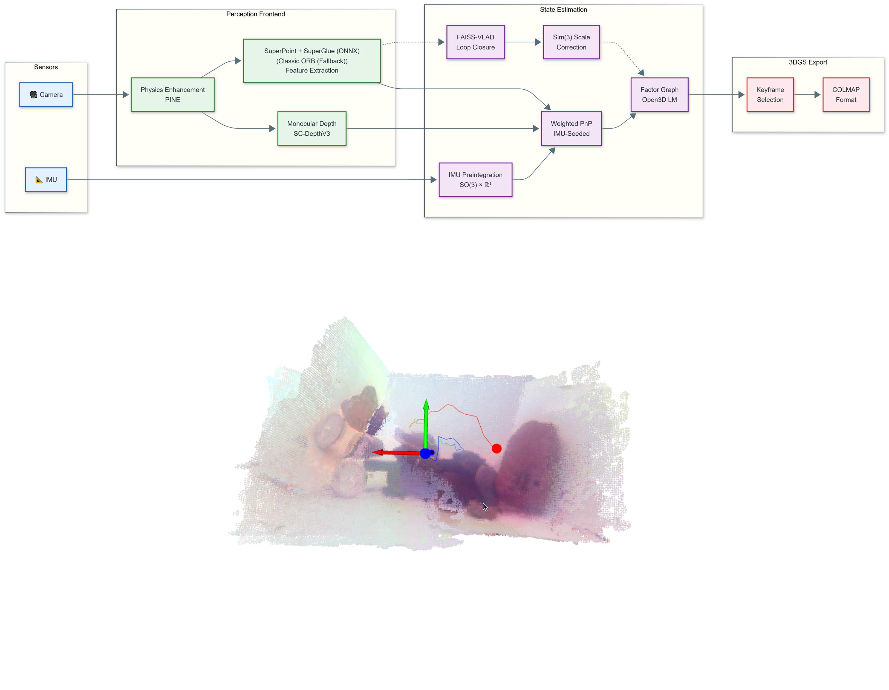

# AquaTwin-VINS
Optimal Perception under Triple Constraints: A Real-time Edge-Based Visual-Inertial Navigation and Digital Twinning Interface for Underwater Exploration
Dataset: https://drive.google.com/file/d/1DQL1M5odR1Rb7ZTxs9L6LqAKBgI8IAIu/view?usp=sharing

Code is here: https://drive.google.com/file/d/1_X24e4DvmfANoFOpf0PYYxd_Ldknx-Py/view?usp=drive_link

please cite:
@article{shao2025pine,
  title={PINE: Physics-Informed Neural Enhancement for Underwater Video via Implicit Representation},
  author={Shao, Jinxin and Miao, Jianming and Zhang, Haosu},
  journal={Available at SSRN 5989034},
  year={2025}
}

@article{shao2026optimal,
  title={Optimal Perception under Triple Constraints: A Real-time Edge-Based Visual-Inertial Navigation and Digital Twinning Interface for Underwater Exploration},
  author={Shao, Jinxin and Miao, Jianming and Zhang, Haosu},
  journal={Available at SSRN 6080666},
  year={2026}
}

Thank you very much!

Dr. Jinxin SHAO
2026/1/16
